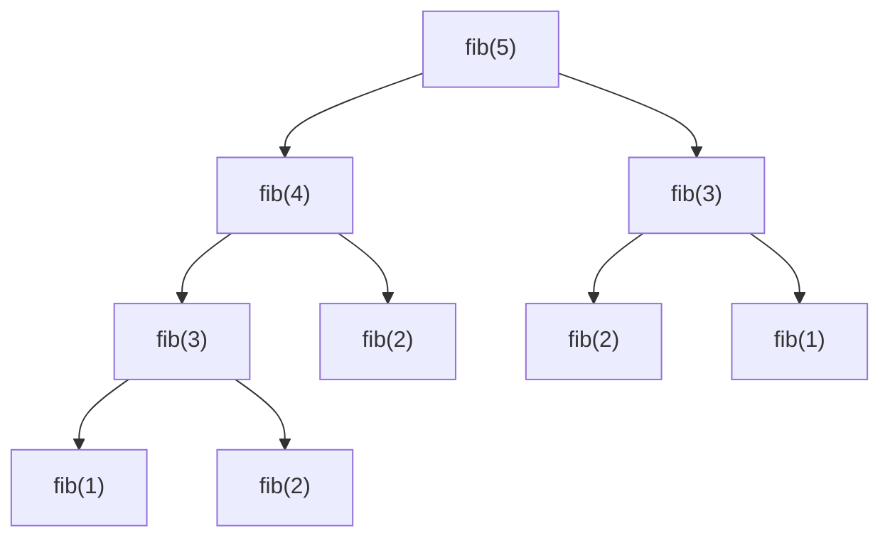

# Dynamic Programming 动态规划

## Fibonacci Sequence

斐波那契数列为 1 1 2 3 5 8
$$递归式为
fib(n) =
\begin{cases}
fib(n-1) + fib(n-2),& n \geq 2\\
fib(n) = 1,& n=1, 2
\end{cases}
$$

```python
# python 递归解法
def fib(x):
    if x in [1,2]:
        return 1
    else:
        return fib(x-1)+fib(x-2)
```



如果用递归的方式，很多数会被重新计算，导致整个复杂度非常高，==即$O(2^n)$== 准确来说应该是$O(2^{n-2})$
如上图所示, fib(3)就计算了2次，如果我们能用一个array将之前计算过的结果存起来，算之后的数字直接调用，那复杂度就能减少到$O(n)$

## 值班-最优解
